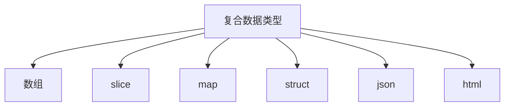

### 1.1 名称

- 函数、变量、常量、类型、语句标签和包都遵循: `字母或下划线开头，后面跟随任意数量的字符，数字和下划线，并且区分大小写`。
- 若实体在函数中声明，那么实体只在函数局部有效。如果声明在函数外，将对包内所有源文件可见。
- 实体的第一个字母的`大小写`决定其可见性是否跨包，大写表示对包外是可见和可访问的。

### 1.2 声明

```go
package main
import "fmt"
const commonConstant = "common"

func main() {
	var a = commonConstant
	var b string // 会默认初始化为""
	var c string = "c"
	var d = "d"
	e := "e"                  // 短变量声明
	x, y := true, 2.3 // 一次定义多个变量
	fmt.Println(a)            // common
	fmt.Println(b)            // ""
	fmt.Println(c)            // c
	fmt.Println(d)            // d
	fmt.Println(e)            // e
	fmt.Println(x)
	fmt.Println(y)
}
```

> 1. 定义变量时如果不指定初始值，那么默认初始化为零值（int为0，string为""...）

### 1.3 变量

#### 1.3.1 指针

指针的值是一个`变量的地址`。使用指针可以在无须知道变量名称的情况下，简洁读取或更新变量的值。

```go
package main
import "fmt"
func pointer() {
	a := "1"
	p := &a         // &z表示获取一个指向整型变量的指针,类型是整型指针(*int)
	fmt.Println(*p) // *p表示p指向的变量
	*p = "2"
	fmt.Println(a) // 2

	var x, y int
	fmt.Println(&x == &x, &x == &y, &x == nil) // true false false

	q := 1
	incr(&q)       // &q所指向的值加1，不依赖返回值就能实现更新
	fmt.Println(q) // 2
	fmt.Println(&q) // 指针地址
	fmt.Println(incr(&q)) // 3
}

func incr(p *int) int {
	*p++ // 递增p所指向的值,p本身不变(p是一个指针地址)
	return *p
}

func flagTest() {
	var str string
	flag.StringVar(&str, "s", "", "将空格替换为指定分隔符") // 传入变量的指针,不需要返回值就能改变str的值
	flag.Parse() // 解析用户传入的命令行参数
	if str != "" {
		fmt.Println(strings.Join(flag.Args(), str)) // 参数是 ./main -s / a bc 输出 a/bc
	} else {
		fmt.Println(flag.Args())
	}
}
```

> 1. &z表示获取一个指向整型变量z的指针,类型是整型指针(*int)
>
> 2. `*p`表示指针p指向的变量，`*p`代表一个变量。而p则代表指针，是一个0x开头的地址。
>
> 3. 为什么使用指针？
     >
     >    a. 相比java中都是`值传递（对形参的修改不会影响实参）`，通过传递指针而不是复制整个数据结构，可以节省时间和内存。
     >
     >    b. 将变量的指针传递给函数，可以`在函数内部直接修改变量的值`，而不需要返回值。

#### 1.3.2 new

通过`new(type)`方式创建变量的指针，常用于`初始化复杂类型的指针`，便于在堆上分配内存。

```go
package main

import "fmt"

func main() {
	p := new(int)
	x := new(int)
	fmt.Println(p)      // 指针的地址
	fmt.Println(p == x) // 每new一次每次的地址都不同
	fmt.Println(*p)     // 初始为0
    p := new(Person)
	fmt.Println(p.Age) // 会被初始化为零值
}

type Person struct {
	Name string
	Age  int
}
```

> new创建的变量是被初始化为`零值`的，Person中的Name和Age分别被初始化为""和0。

#### 1.3.3 变量的生命周期

> 生命周期：程序执行过程中变量存在的时间段。
>
> `包级别`的变量生命周期伴随着`整个程序`的执行时间。
>
> `局部变量`的生命周期，每次执行声明语句时创建一个新的实体，一直存在到`不可访问`。
>
> 通过可达性算法来判断变量是否能够回收。与`JVM从根对象`出发判断类似，将`包级别的变量`、`当前执行函数的局部变量`作为源头，通过`指针或其他方式`的引用可以找到的变量则被视为可达。

```go
package main

var global *int

func f() {
   var x int
   x = 1
   global = &x
}
func g() {
    y := new(int)
    *y = 1
}
```

> 1. 针对f()函数，尽管在其返回后还能通过global访问，这种情况成为`x从f中逃逸`。
> 2. 当g()函数返回时，*y变得不可访问，可以被回收。这种情况被`*y无法从g中逃逸`。

### 1.4 赋值

```go
func assign() {
	var x int
	x = 1 // 有名称的变量
	fmt.Printf("x: %d\n", x)

	y := &x
	*y = 2 // 通过指针间接赋值
	fmt.Printf("*y: %d\n", *y)

	p := new(Person)
	p.Name = "lucy" // 结构体成员
	fmt.Printf("name: %s\n", p.Name)

	s := []int{1, 2, 3} // 数组或slice或map的元素
	fmt.Printf("slice: %d\n", s[1])

	c := 1
	c++
	c--
	fmt.Printf("c: %d\n", c)

	a := 0
	b := 1
	a, b, c = b, a, a+b // 多重赋值,即一次性赋值多个变量,并且变量支持右侧表达式推演
	fmt.Printf("a: %d, b: %d, c: %d\n", a, b, c)
}
```

> 1. 有名称的变量赋值
> 2. 通过指针间接赋值
> 3. 结构体成员赋值
> 4. 数组或slice或map元素赋值
> 5. 多重赋值，一次赋值多个变量（左侧的变量个数需要和函数的返回值一样多，不需要的值赋值给`空标识符_`）

### 1.5 包和文件

在go语言中包的作用和其他语言的库或模块作用类似，用于支持`模块化、封装、编译隔离和重用`。

```go
go init mod <module name> // 初始化module
go mod tidy // 整理依赖
```

```shell
.
├── README.md
├── src
│   └── source.go
├── go.mod
├── main.go
└── chapter1
    ├── README.md
    └── chapter1.go
```

```go
package main

import (
	"go-in-action/chapter1" // <moduleName>/<folderName>
)

func main() {
	chapter1.Main()
}
```

> 1. 大写开头的func才能够被其他go文件引用
> 2. import引入的路径只需要包含文件夹，不需要包含文件名称
---

### 2.1 基础类型


graph TD;
    A[数据类型]-->B[基础类型];
    A[数据类型]-->C[聚合类型];
    A[数据类型]-->D[引用类型];
    A[数据类型]-->E[接口类型];
    B[基础类型]-->F[数值];
    B[基础类型]-->G[字符串];
    B[基础类型]-->H[布尔值];



> go的基础类型主要包含`整数、浮点数、复数、布尔值和字符串`。

#### 2.1.1 整数

有符号分为int8、int16、int32、int64，无符号分为uint8、uint16、uint32、uint64。

```go
func bit() {
	/*
			 1<<1: 00000001 -> 00000010
			 1<<5: 00000001 -> 00100000
			 或运算：有1为1否则为0
			  00000010
			| 00100000
			————————————
		      00100010
	*/
	var x uint8 = 1<<1 | 1<<5
	fmt.Printf("%08b\n", x) // 00100010
	fmt.Printf("%d\n", x)   // 34
}
```


> 1. 有符号和无符号的区别在于`最高位是否是符号位`，n位数字的取值范围是`-2^n-1 ~ 2^(n-1) -1`，无符号的取值范围是`0 ~ 2^n -1`
> 2. int默认是32位，但是`int32不等于int`，需要显示转换。
> 3. int32可以用`rune`表示，int8可以用`byte`表示。

#### 2.1.2 浮点数

go具有两种大小的浮点数：`float32和float64`，最大值分别是`math.MaxFloat32、math.MaxFloat64`。

```go
func float() {
	var f32 float32 = math.MaxFloat32
	var f64 float64 = math.MaxFloat64

	fmt.Printf("f32: %8.1f\n", f32) // 8表示输出的值不足8个字符，则会用空格填充 1表示保留小数点后1位
	fmt.Println(f64)
}
```

#### 2.1.3 布尔值

go中的bool值只有两种可能：true或false。布尔值取反前面加`!`。

#### 2.1.4 字符串

字符串是`不可变`的字节序列，他可以包含任意数据，包括0值字节。

```go
func str() {
	s := "你好世界"     // 默认按照utf8进行编码
	fmt.Println(len(s)) // 输出字符数量

	// 获取utf8下字符的编码值
	for i := 0; i < len(s); {
		r, size := utf8.DecodeRuneInString(s[i:])
		fmt.Printf("Character: %c, Code: %d\n", r, r)
		i += size
	}

	/*
		获取utf8下字符的编码值
		Character: 你, Code: [228 189 160]
		Character: 好, Code: [229 165 189]
		Character: 世, Code: [228 184 150]
		Character: 界, Code: [231 149 140]
		如果只包含ascii字符，那么直接通过s[i]来获取
	*/
	for _, char := range s {
		fmt.Printf("Character: %c, bytes: %v\n", char, []byte(string(char)))

	}

	fmt.Println(s[0], s[7])     // 通过下标访问，返回的是uint8类型的字节编码，即228和184
	fmt.Println(s[0:6])         // 默认会输出字符
	fmt.Println([]byte(s[0:5])) // 输出rune字节数组
	
	// 字符串的不可变性，a和b共用了底层字节数组
	a := "a"
	b := a
	a += "b"
	fmt.Println(a)
	fmt.Println(b)
    
    // []byte和string互转
    x := "abc"
	y := []byte(x)
	z := string(y)
	fmt.Printf("x: %s, y: %v, z: %s", x, y, z)
}
```

> 1. go中基于unicode（每个字符都有一个码点值，可用整数表示）设计出`rune`类型，底层是`int32（4个字节）`，用来容纳任意的unicode字符。
> 2. 在ASCII编码下，可以通过`[索引地址]`的方式获取字符，若是UTF8的编码下，因为其是`多个字节`组成的，此方法获取的是某个字符中的某个字节。
> 3. 可以通过`utf8.DecodeRuneInString`获取中文字符中的第一个字符。
> 4. 字符串是`不可变`的，类似java的字符串常量池，go的底层使用了字节数组。两个字符串可以安全的共用同一段底层内存。
>
> 

#### 2.1.5 常量

常量是一种表达式，可以保证在编译阶段就计算出表达式的值，并不需要等到运行时，从而是编译器得以知晓其值。常量本质上都属于基本类型，布尔型、字符串或者数字。

```go
func constant() {
	const hello string = "hello" // 定义string类型的常量
	const (
		a int = iota // 从0依次曾增加1
		b
		c
		d
	)
	fmt.Println(a, b, c, d) // 0 1 2 3

	const t = 10                                // 无类型常量，会根据上下文确认转为不同的类型
	fmt.Printf("type: %T, v: %d\n", t+1, t+1)   // 此时t是int类型
	fmt.Printf("type: %T, v: %f", t+0.1, t+0.1) // 此时t是float64类型
}
```

> 1. 不定义类型的常量，在使用时会根据上下文根据判断会转为不同的类型。
> 2. 可以一次定义多个常量，基于iota实现自动增长。

---


#### 2.2.1 数组

数组是具有`固定长度`且拥有n个(n>=0)`相同数据类型`元素的序列。数组中的元素都是通过索引来访问的。

```go
func array() {
	arr := []int{1, 2, 3} // 初始化数组
	arr[2] = 4            // 修改index为2的值为4
	for i, a := range arr {
		fmt.Printf("index: %d, value: %d\n", i, a)
	}

	var arr2 [3]int                   // 定义3个整数的数组，默认初始化为零值
	arr2 = [...]int{1, 2, 3}          // 数组的字面量是...时 表示其值由初始化数组的个数决定
	arr2 = [...]int{0: 1, 1: 2, 2: 3} // 分别指定index为0的值为1，以此类推
	arr2 = [...]int{2: 3}             // 指定index为2的值为3，此时数组是三个元素，其他都是零值
	for i, a := range arr2 {
		fmt.Printf("index: %d, value: %d\n", i, a)
	}
	fmt.Printf("type: %T\n", arr2) // [3]int

	arr3 := [...]int{1, 2, 3}
	fmt.Printf("arr2 type: %T, arr3 type: %T, equals?: %t\n", arr2, arr3, arr2 == arr3) // false
}

/*
证明函数参数是值传递方式
*/
func transfer() {
	arr := [...]int{1, 2, 3}
	fmt.Printf("before arr value: %d, type: %T, location: %p\n", arr, arr, &arr) // 打印arr的地址和值
	modifyValue(arr)
	fmt.Printf("after arr value: %d, type: %T, location: %p\n", arr, arr, &arr) 
	modifyValue3(&arr) // 传递指针会修改源数据的值
	fmt.Printf("after arr value: %d, type: %T, location: %p\n", arr, arr, &arr)
}
/*
修改传递的数组里面的元素值
*/
func modifyValue(array [3]int) {
	fmt.Printf("modify arr value: %d, type: %T, location: %p\n", array, array, &array)
	array[0] = 100
}
/*
使用指针作为参数，会修改源数组
*/
func modifyValue3(p *[3]int) {
	fmt.Printf("modify2 arr value: %d, type: %T, location: %p\n", *p, *p, p)
	p[0] = 101
}
```

> 1. 数组初始化时不指定初始化值会默认设置为`零值`，使用`...`替代数组字面量值，大小默认由`数组初始化值数量`决定。
> 2. 数组字面量是数组类型的一部分，`[3]int != [4]int`。
> 3. 数组作为函数的形参时，是基于`值传递`实现传参（即将数组复制一份作为函数的参数），所以对形参的修改不会影响实参。
> 4. 若将`数组的指针`作为参数的形参，那么对其进行修改时，会影响到原始数组。

#### 2.2.2 slice

slice表示一个拥有相同类型元素的`可变长度`的序列（参考java的List、python的切片）。用来访问数组的部分或者全部的元素。这个数组被成为slice的`底层数组`，slice是具备三个属性：`指针`、`长度`和`容量`的轻量级数据结构。


> 1. 指针指向数组的第一个可以从slice中访问的元素（并不一定是数组的第一个元素）。
> 2. 长度是指slice中的元素个数，不能超过slice的容量（cap）。
> 3. 容量的大小默认由`slice的起始元素到底层数组的最后一个元素`间元素的个数。
>
> 4. slice可以理解成数组的别名，`slice并不存储数据`，其作为形参传递时，对slice的修改`会影响到底层数组`。

```go
func sliceTest() {
	months := [...]string{
		1: "January", "February", "March", "April",
		"May", "June", "July", "August",
		"September", "October", "November", 12: "December",
	}
	fmt.Printf("type: %T, len: %d\n", months, len(months)) // [13]string 表示数组

	m1 := months[1:3]                                                // 1,2不包含3
	fmt.Printf("type: %T, len: %d, cap: %d\n", m1, len(m1), cap(m1)) // []string 表示slice cap表示slice的容量 len=2 cap=12

	m1[0] = "temp"
	fmt.Printf("type: %T, m1[0]: %s， month[0]: %s\n", m1, m1[0], months[0]) // slice包含指向底层数组的指针，无论是slice改变或者底层数组改变都会互相影响

	s1 := make([]int, 3) // 使用make创建slice，如果不指定cap，默认等于len，底层数组长度为3，且默认设置元素为零值
	fmt.Println(s1)

	s2 := []int(nil) // 将nil作为slice的元素，没有对应的底层数组，且长度和容量都为0
	s3 := []int{}    // 初始化空slice，不为nil
	var s4 []int = nil
	fmt.Printf("s2 == nil: %t, len(s2): %d\n", s2 == nil, len(s2)) // true 0
	fmt.Printf("s3 == nil: %t, len(s3): %d\n", s3 == nil, len(s3)) // false 0
	fmt.Printf("s4 == nil: %t, len(s4): %d\n", s4 == nil, len(s4)) // true 0
    
    fmt.Println(appendInt([]int{1, 2, 3}, 4, 5, 6)) // 添加4,5,6到slice末尾
}
/*
将y追加到[]int后
需要考虑到cap 扩容问题
其功能等同于 append()
*/
func appendInt(x []int, y ...int) []int {
	var z []int
	zlen := len(x) + len(y)
	if zlen <= cap(x) {
		z = x[:zlen] // 扩容len(y)
	} else {
		zcap := zlen // zlen > zcap 说明底层数组容量不够需要扩容了
		if zcap < zlen<<1 {
			zcap = zlen << 1 // 扩容2倍

		}
		z = make([]int, zlen, zcap)
		copy(z, x)
	}
	copy(z[len(x):], y)
	return z
}
```

##### 2.2.2.1 测验

- 重写reverse，使用数组指针作为参数而不是slice

```go
func sliceTest1(x *[3]int) {
	for i, j := 0, len(*x)-1; i < j; i, j = i+1, j-1 {
		x[i], x[j] = x[j], x[i]
	}
}
```

- 重写一个函数rotate，实现一次遍历就可以完成元素旋转

```go
func rotate(x []int) {
	for i := 0; i < len(x)/2; i++ {
		temp := x[len(x)-1-i]
		x[len(x)-1-i] = x[i]
		x[i] = temp
	}
}
```

- 编写一个就地处理函数，用于去除[]string slice中相邻的重复字符串元素

```go
func duplicate(x []string) []string {
	var count int
	l := len(x)
	for i := 0; i < l-count; i++ {
		if x[i] == x[i+1] {
			count++
			copy(x[i:], x[i+1:])
			i-- // 指针回退
		}
		fmt.Printf("i: %d, count: %d, x: %v\n", i, count, x)
	}
	return x[:len(x)-count+1] // slice 左闭右开
}
```

> 无论是数组还是slice，作为形参都是值传递（副本，除非是指针作为形参）。

#### 2.2.3 map

map是一个拥有键值对的`无序`集合，键是唯一的，值的类型没有任何限制，时间复杂度为O(n)。

```go
func mapTest() {
	m1 := make(map[string]int) // 初始化map

	m2 := map[string]int{ // 初始化map包含字面量
		"a": 1,
		"c": 2,
		"d": 3,
		"b": 4,
	}
	m3 := map[string]int{}            // 初始化空map
	var m4 map[string]int             // 尚未初始化的map，零值为nil
	m5 := map[string]map[string]int{} // 定义key为string，value为map[string]int的map

	fmt.Printf("m1: %v, nil: %t\n", m1, m1 == nil) // false
	fmt.Printf("m2: %v, nil: %t\n", m2, m2 == nil) // false
	fmt.Printf("m3: %v, nil: %t\n", m3, m3 == nil) // false
	fmt.Printf("m4: %v, nil: %t\n", m4, m4 == nil) // true
	fmt.Printf("m5: %v, nil: %t\n", m5, m5 == nil) // false

	m4 = make(map[string]int)
	m4["a"] = 1      // 向零值的map设置元素会报错，必须先初始化
	m4["a"] = 2      // 更新map中对应的key值
	v, ok := m4["b"] // 获取value的同时判断值是否在map中
	fmt.Printf("m4[\"b\"]: %d, in m4? %t\n", v, ok)
	delete(m4, "a") // 删除map中key为a的元素

	// 根据map的key排序，间接实现map的有序输出
	var keys []string
	for key, _ := range m2 {
		keys = append(keys, key)
	}
	sort.Strings(keys)
	for _, k := range keys {
		fmt.Printf("key: %s, value: %d\n", k, m2[k])
	}
}
```

#### 2.2.4 结构体

结构体是将`n个任意类型(n>=0)的命名变量`组合在一起的聚合数据类型。

```go
func structTest() {
	person := new(Person)
	person.id = 1
	person.name = "lucy"
	person.age = 18
	p := &person
	fmt.Println((*p).name)
	fmt.Println(person.name)

	// 基于结构体字面量创建，变量必须可以访问
	p2 := Person{1, "jack", 32} // 基于顺序创建
	fmt.Println(p2)
	p3 := Person{name: "lucy", age: 20, id: 2} // 通过kv形式创建
	fmt.Println(p3)
	// 通常struct通过指针访问，避免值传递带来的复制的性能
	p4 := &Person{3, "harden", 33}          // 等价于 p4 := new(Person) *p4 = Person{3,"harden",33}
	fmt.Printf("p4: %#v\n", p4)             // 按照go的格式输出结构体
	fmt.Printf("p3 == p4 ? %t\n", p2 == p3) // == 会依次比较结构体中变量的值

// Person 变量首字母大小，表示可被其他包访问和使用，首字母小鞋只能在定义它的包内使用
type Person struct {
	id   int
	name string
	age  int
}
```

> 1. 成员变量`首字母大写`表示可以跨包访问，首字母小写，只能被当前包域访问。
> 2. 结构体初始化支持按照`变量顺序或按照key-value`的形式创建（类似java的全量构造方法和部分变量的构造方法）。
> 3. go的结构体推荐使用指针访问(`p := &Person{1, "", 1}`)，避免大结构体因为形参的`值传递`拷贝带来的性能损耗。
> 4. 结构体之间进行`==`比较，go会按照成员变量的顺序依次比较。

##### 2.2.4.1 匿名成员

```go
// 包含匿名成员的结构体赋值
func personNestedTest {
	var p5 PersonNested
	p5.no = 1 // 等同于 p5.address.no = 1
	p5.street = "长安大街"
	p5.name = "ming"
	fmt.Printf("p5: %#v\n", p5)
	// 不能通过 &PersonNested{name: "hong", no: 2, street: "沈阳大街"} 初始化字面量
	p6 := &PersonNested{"hong", address{2, "沈阳大街"}}
	fmt.Printf("p6: %#v\n", p6)
	p7 := &PersonNested{ // 初始化效果等同于p6
		name: "hong",
		address: address{
			no:     2,
			street: "沈阳大街",
		},
	}
	fmt.Printf("p6 == p7? %t\n", p6 == p7)     // false 指针地址不同
	fmt.Printf("*p6 == *p7? %t\n", *p6 == *p7) // true 成员字面量相同
}

type PersonNested struct {
	name    string
	address // go允许定义不带名称的结构体变量，只需要指定类型即可，这种结构体成为被称为匿名成员
}

type address struct {
	no     int
	street string
}
```

> 1. 定义不带名称的结构体变量，只需要指定类型即可，这种结构体成为被称为匿名成员。
> 2. 匿名成员进行赋值时，可以省略通过`.匿名成员类型`的方式赋值。
> 3. 匿名成员初始化字面量时`不支持通过key-value`的形式，需要按照嵌套的结构进行赋值。

##### 2.2.4.2 二叉树排序

```go
// Sort 二叉树排序
func Sort(values []int) {
	var root *Tree
	for _, v := range values {
		root = add(root, v)
	}
	fmt.Printf("root: %v", root)
	appendValues(values[:0], root) // values[:0]作用等同于清空values，但不改变len
	fmt.Printf("values: %v", values)
}

func appendValues(values []int, t *Tree) []int {
	if t != nil {
		values = appendValues(values, t.left)
		values = append(values, t.value)
		values = appendValues(values, t.right)
	}
	return values
}
// 递归添加节点
func add(t *Tree, value int) *Tree {
	if t == nil { // 初始化根节点
		t = new(Tree)
		t.value = value
		return t
	}
	if value < t.value {
		t.left = add(t.left, value)
	} else {
		t.right = add(t.right, value)
	}
	return t
}
```

#### 2.2.5 JSON

```go
func jsonTest() {
	p := &PersonNested{"harden", address{0, "长安大街"}}
	j, e := json.Marshal(p) // 将结构体转换为 JSON 字符串
	if e != nil {
		log.Fatalf("JSON marshal error: %s", e.Error())
	}
	fmt.Printf("JSON data: %s\n", j)

	j2, e := json.MarshalIndent(p, "", " ") // 格式化输出json串 prefix表示每行输出的前缀欺负成，indent表示每个层级的缩进字符串
	if e != nil {
		log.Fatalf("JSON marshal error: %s", e.Error())
	}
	fmt.Printf("JSON data: %s\n", j2)

	resp, _ := http.Get("https://xkcd.com/571/info.0.json")
	var r map[string]interface{}
	if err := json.NewDecoder(resp.Body).Decode(&r); err != nil { // 使用json.NewDecoder的方式解析json
		_ = fmt.Errorf("error: %s", resp.Status)
	}
	fmt.Printf("resp: %#v", r)
}
```

> 1. json.Marshal将结构体转为[]byte，json.Unmarshal将[]byte转为结构体
> 2. 还可以使用`json.NewDecoder().Decode()`流式解码器来实现json的解析

#### 2.2.6 文件与html

```go
func textHtmlTest() {
    // range需要搭配end使用，支持函数执行
	const temp = `Convert: {{.Input | convert}}, Users: {{range .Users}}- {{.Name}} ({{.Age}} years old) {{end}}` 
    // template中使用的函数需要先添加进来
	t, err := template.New("hello").Funcs(template.FuncMap{"convert": convert}).Parse(temp)                       
	if err != nil {
		fmt.Printf("parse error: %s\n", err.Error())
	}
	data := map[string]interface{}{
		"Input": "input",
		"Users": []map[string]interface{}{
			{"Name": "Alice", "Age": 25},
			{"Name": "Bob", "Age": 30},
			{"Name": "Charlie", "Age": 28},
		},
	}
	err = t.Execute(os.Stdout, data)
	if err != nil {
		fmt.Printf("parse error: %s\n", err.Error())
	}
}

func convert(input string) string {
	return input + "-output"
}
```
---
## 3. 函数

### 3.1 函数声明

```go
/*
func func_name(parameter-list) (result-list){}
*/
func x0(a, b int, c string) (x, y int, z string) {
	return // 等同于return x,y,z 称为裸返回（按照返回值顺序返回）
}
```

> 1. 函数的参数传递是按`值传递`的，函数接收到是实参的副本。
> 1. 存在多个相同类型的参数时，可以使用简写 x,y int。
> 2. 可以给返回值进行声明，声明为`局部变量`，并会根据类型`初始化为零值。`
> 3. 若已经给返回值进行变量声明，那么函数中可以直接使用return返回。
> 3. 当两个函数拥有相同的形参列表和返回列表时，那么这两个函数的`类型或签名是相同的`。

### 3.2 异常构建

```go
func main() {
	if err := waitForServer("https://github1.com", 10*time.Second, 2*time.Second); err != nil {
		fmt.Printf("waitForServer: %s\n", err)
	}
}
/*
url: 请求的url
timeout： 全部请求超时间隔
requestTimeout： 每次请求的间隔
*/
func waitForServer(url string, timeout time.Duration, requestTimeout time.Duration) error {
	deadline := time.Now().Add(timeout)
	client := http.Client{
		Timeout: requestTimeout, // http client设置超时时间
	}
	for i := 0; time.Now().Before(deadline); i++ {
		_, err := client.Head(url) // 只获取响应头信息，不获取响应体
		if err == nil {
			return nil
		}
		fmt.Printf("server not responding (%s), retrying...\n", err)
		time.Sleep(time.Second << i) // 指数级增长
	}
	//return fmt.Errorf("server %s failed to respond after %s\n", url, timeout) // 创建格式化错误信息
	return fmt.Errorf("server %s failed to respond after %s\n", url, timeout) // 创建格式化错误信息
}
```

> 1. `error`是内置的接口类型，当其值为非空值，意味着失败，为控制意味着成功。
> 2. go语言中使用`普通的值`来不是异常来报告错误，使用fmt.Errorf()构建新的error错误值。

### 3.3 匿名函数

> 函数字面量就像函数声明，但在func关键字后面没有函数的名称，它是一个表达式，它的值被称为匿名函数。

```go
func main() {
    // 匿名函数作为参数
    s := strings.Map(func(r rune) rune {
	    return r + 1
    }, "HAL-9000")
    fmt.Printf("map: %#v\n", s)
    a := anonymousFunc() // 获取匿名函数的引用，因为返回的是func() int类型
    fmt.Println(a()) // 此时匿名函数a中的局部变量x=1
    fmt.Println(a()) // 此时匿名函数a中的局部变量x=2
    func(x int) { fmt.Printf("x: %d\n", x) }(1) // 构建匿名函数并调用
}

/*
匿名函数作为返回值类型
*/
func anonymousFunc() func() int {
	var x int // 能够被内层的匿名函数访问和更新
	return func() int {
		x++
		return x * x
	}
}
```

#### 3.3.1 迭代变量捕获

```go
/*
演示go的循环迭代变量捕获问题
*/
func test1() {
	var funcs []func()
	num := []int{1, 2, 3, 4}
	for _, num := range nums {
		// num := num                     // 避免迭代变量捕获问题
		funcs = append(funcs, func() { // 构建匿名函数的slice，for循环结束后num的值为4，num共用一个内存地址，每次都是更新值
			fmt.Printf("num: %d\n", num) // 匿名函数中记录的num不是值，是内存地址
		})
	}
	for _, f := range funcs {
		f() // 执行匿名函数时，num的值随着迭代结束已经变为4
	}
}
```

> 1. 迭代的变量num使用的`是同一个内存地址`，每次循环都是更新内存地址对应的值。
> 2. 在第一个循环中生成的所有匿名函数都`共享相同的循环变量num（逃逸到堆中）`，且num记录的是`迭代变量的内存地址`，而不是值。
> 3. 在匿名函数执行时，num中存储的值等于最后一次迭代的值，所以打印的都是相同的数字4。
> 4. 只需使用`局部变量拷贝循环变量的值`，这样在匿名函数中局部变量num记录的就是`某一时刻循环变量的值`，而不是循环变量的地址。

### 3.3.4 变长函数

变长函数在被调用的时候可以有`可变的参数个数`，其本质就是一个某种类型的slice。(java中的可变参数其实是个数组)

```go
func test(a ...int) {
    fmt.Printf("type: %T", a) // []int
}

func main() {
    test(1,2,3)
    a := []int{1,2,3}
    test(a...)
}
```

> 对于已经存在的一个slice，通过添加`...`实现对变长函数的调用。

### 3.3.5 延迟函数

defer用于延迟执行一个函数调用，该函数会在`当前函数返回之前`被调用执行，无论该函数是正常返回还是发生异常。存在多个defer语句时，调用的顺序是`后进先出`。常用于`关闭文件、资源释放、释放锁及跟踪函数执行`。

```go
func test3() {
	resp, err := http.Get("https://baidu.com")
	if err != nil {
		fmt.Printf("error: %s", err.Error())
	}
	defer resp.Body.Close() // 关闭资源
}

func test4() {
	fmt.Println("step1")
	defer fmt.Println("step2")
	defer fmt.Println("step3")
    // step1 -> step3 -> step2
}

func test5() {
	defer test6("test5")() // 会获取函数但会等到return前再执行
	time.Sleep(2 * time.Second)
	fmt.Println("test5 do something...")
}

func test6(msg string) func() {
	now := time.Now() // 会在一开始获取函数值时就计算
	log.Printf("enter %s", msg)
	return func() {
		log.Printf("exit %s(%s)", msg, time.Since(now))//time.Since(now)会在test5返回时才会计算
	}
}
```

> 1. 执行`defer test6("test5")()`时，会先获取函数值（即test6中返回的匿名函数）但不会立马执行，会等到test5()方法返回前再执行。
> 2. defer函数执行时，其函数中的变量（即time.Since(now)）才会被确定，并在函数返回前保持不变。

### 3.3.6 宕机与恢复

当程序遇到无法处理的错误或异常情况时，可以使用 `panic` 函数引发 panic。Panic会导致程序立即停止执行，并开始执行调用栈的展开过程，在其展开过程中执行defer函数，最后程序终止。

`recover()`是一个内建函数，能够处理panic异常，其只能在defer函数中使用，用于捕获和处理panic异常。

```go
func test7() {
    defer fmt.Println("defer print")
	defer func() {
		if r := recover(); r != nil {
			fmt.Println("Recovered from panic:", r)
		}
	}()
	panic("Something went wrong")                // 宕机并输出日志信息和栈转储信息到stdout
	fmt.Println("This line will not be printed") // 不会被执行
    // Recovered from panic: Something went wrong -> defer print 
}
```

> 1. 在使用recover()函数时，Panic不会导致程序停止执行，会被recover()捕获和处理。
> 2. recover()只能在defer函数中执行，存在多个defer函数时仍然按照`后进先出`的原则调用。

---
## 4. 方法

#### 4.1 定义

在go中没有类的概念，一般用struct来代替类的操作，但struct中只包含字段属性，所以go提供了一种特殊的函数，其通过`作用在某个接收者上面来实现与其关联`。

```go
// func (接收者 接收者类型) 方法名(参数列表) 返回值类型 {}

func main() {
    p := Person{"jack", 18}
	fmt.Printf("person: %p, person name: %s\n", &p, p.Name)
	p.printPerson()     // 基于值复制的传参
	(&p)._printPerson() // 基于指针的传参
	p._printPerson()    // 与(&p)效果相同，因为编译器会做隐式的转换

	var p1 *Person
	p1._printPerson() // 当指针类型作为接收者时，类型可以为nil，值类型不可以为nil
}

func (p Person) printPerson() { // person作为接收者类型
	fmt.Printf("person: %p, person name: %s\n", &p, p.Name)
}
// 允许nil作为接收者
func (p *Person) _printPerson() { // 指针作为接收者类型
	if p == nil {
		fmt.Printf("person: %p", p)
		return
	}
	(*p).Name = "lucy"
	fmt.Printf("person: %p, person name: %v\n", p, (*p).Name)
}

type Person struct {
	Name string
	Age  int
}
```

> 1. 相比函数，方法与其的区别在于多了接收者，即`把方法绑定到这个接收者对应的类型上`。
> 2. 接收者可以是任何类型，但不能是接口，因为接口是抽象定义，方法确实具体实现。
> 3. 允许出现接收者类型不同，但是方法名相同的方法。
> 4. 接收者类型是指针时使用的是`引用传递`，其他则是`值传递`，针对同一个结构体的方法的接收者类型需要统一。
> 5. 只有当接收者类型为指针时，可以将`nil作为实参`传入。
> 6. 当实参是T类型的变量而形参的接收者是*T类型时，`编译器会隐式的获取变量的地址`。

#### 4.2 结构体内嵌的类型

```go
type Inner struct{ A, B int }

func (i Inner) inner() {
	fmt.Printf("Inner: A: %d, B: %d\n", i.A, i.B)
}

func (o Outer) outer() {
	fmt.Printf("Outer: C: %s\n", o.C)
}

type Outer struct {
	Inner
	C string
}

func test3() {
	o := &Outer{Inner{1, 2}, "3"}
	o.outer()
	o.inner() // 作用等同于o.Inner.inner()
}
```

> 通过结构体的嵌套，可以无感的调用内嵌的结构体的方法。

#### 4.2 方法变量和方法表达式

```go
type Person struct {
	Name string
	Age  int
}

func (p *Person) modifyPerson() { // 指针作为实参的接收者类型
	fmt.Printf("person: %#v\n", p) // 打印接收者参数
}

func test5(f func(*Person)) { // 方法表达式作为形参需要指定类型
    p := &Person{"lucky", 18}
    f(p)
}

func main() {
    p := &Person{"jack", 20}
    person := p.modifyPerson // 获取方法变量，只能在方法所属的实例p上调用
    person() // 调用方法 效果等同于 p.modifyPerson() 不需要指定接收者
    
    person2 := (*Person).modifyPerson // 获取方法表达式
    person2(p) // 调用方法表达式时需要传入接收者实参
    
    test5(person2) // 将方法表达式作为函数参数传递
}
```

> 1. 方法变量：接`将方法赋值给一个变量`，不需要指定接收者，只能在方法所属类型的实例上调用，不能在其他类型的实例上调用。
> 2. 方法表达式：方法表达式的语法是`T.methodName`，需要`显式指定接收者类型`作为第一个参数。可以作为普通函数一样传递。

#### 4.3 封装

如果变量或者方法不是通过对象访问到的，这称作`封装的变量或者方法（又称数据隐藏）`。

```go
// 在另一个包中调用Logger的方法
func test6() {
	l := &Logger{}
	l.SetFlags(1)
	fmt.Printf("flags: %d", l.Flags())
}

// Logger 定义实体，但字段是当前包私有，无法导出的
type Logger struct {
	flags  int
	prefix string
}

// Flags 等同于java中字段的getFlags方法，go默认去掉get，且可导出，所以方法名大写
func (logger *Logger) Flags() int {
	return logger.flags
}

func (logger *Logger) SetFlags(flag int) {
	logger.flags = flag
}
```

> 1. go中的封装效果等同于Java中的类字段属性设为私有，但是对外提供getter和setter用来修改字段属性。
> 2. go中的getter方法是默认去掉get的，比如getAge在go中就是Age，注意需要大写（因为需要对其他包导出）。

---
## 5. 接口

接口类型是对其他类型行为的概括和抽象。相比java的显示声明，go的独特之处在于它是`隐式实现`，对于一个具体的类型，无须声明它实现了哪些接口，只需要提供接口所必须的方法即可。

```go
// interface{}效果等同于java中的Object
func test1(args ...interface{}) {
	fmt.Println(args)
}
// any等同于interface{}
func test2(args ...any) {
	fmt.Println(args)
}
```

> 1.go中提供了一种接口类型，即`interface{}`，等价于java的Object。1.18版本后可以使用any替换，效果是等价的。

```go
type Object interface {
	equals(source any, target any) bool // 此处不需要定义接收者类型，与给struct定义方法不同
	Say                                 // 接口嵌套接口
}

type Say interface {
	doSay(something string) (word string)
}

type Phone interface {
	Call()
}

type Iphone struct {
}

type Android struct {
}

func (i Iphone) Call() { // 方法名、参数与返回值都必须相同
	fmt.Println("i'm iphone!")
}

func (a Android) Call() {
	fmt.Println("i'm android!")
}

func test3() {
	var phone Phone // 声明接口类型的变量
	phone = new(Iphone)
	phone.Call()

	phone = new(Android)
	phone.Call()
}
```

> 1. 接口的动态值：接口的类型信息 & 接口值的具体值或底层对象的副本。
> 2. go的接口是隐式实现，一个类型只需要实现接口所定义的`所有方法`，无需显示声明。
> 3. 接口是值类型，可以作为`函数的参数和返回值`，也可以`赋值给其他接口变量`。接口类型的零值是`nil`。
> 4. 接口变量在运行时存放的是`实际的对象和值`，通过类型断言可以将接口变量转换为具体类型，并访问其属性和方法。

### 5.1 接口断言

类型断言是一个作用在接口值上的操作，即`x.(T)`其中x是一个接口类型的表达式，T是一个类型（称为断言类型）。即`x的动态类型是否是T`。

```go
func test5() {
	var p Phone
	p = Iphone{}
	i := p.(Iphone) // 接口断言：如果p的动态类型是Iphone，那么会返回p的动态值
	i.getIphone()   // 调用Iphone类型独有的方法（非实现的接口方法）

	defer func() {
		if r := recover(); r != nil {
			fmt.Printf("s0 print error: %s\n", r)
		}
	}()
	s0 := p.(Say) // 会产生panic
	s0.doSay("hello")

	if s, ok := p.(Say); ok { // ok返回bool值，表示p的类型是否是Say
		fmt.Printf("%#v\n", s)
	} else {
		fmt.Println("panic: interface conversion")
	}
}
```
---
## 6. goroutine和channel

> 1. goroutine是Go语言中的轻量级线程，可以并发地执行函数或方法。
> 2. channel是goroutine之间进行通信和数据交换的管道。
> 3. goroutine与channel用于实现`并发和协程间的通信`。

### 6.1 goroutine

goroutine是一种`轻量级的并发执行单元`，可与其他goroutine并行运行，相比线程，goroutine创建和切换的开销很小。通过`go`关键字来创建。使用`go`关键字启动一个函数或方法的执行时，会在一个单独的goroutine中运行该函数，与主goroutine并发执行。

```go
func test1() {
	concurrent(false)
    // 通过关键字go创建goroutine
	go concurrent(true) 
	time.Sleep(time.Second * 5)
}

func concurrent(sleep bool) {
	if sleep {
		time.Sleep(time.Second * 2)
	}
	fmt.Printf("123\n")
}
```

> 与java类似，一个程序启动的时候会有一个主goroutine，主goroutine结束时，会导致其他的goroutine也结束。

### 6.2 channel

channel(通道)是一种用于在`goroutine`之间进行通信和同步的机制。通过发送操作发送数据到通道，从通道接收数据，发送和接收操作都是原子的，保证了数据的完整性和一致性。

```go
/*
一个goroutine生产数据，主goroutine读取数据
*/
func test7() {
	ch1 := make(chan int) // 创建一个类型为`chan int`的无缓存通道
	go func() {
		for x := 0; ; x++ {
			time.Sleep(time.Second)
			ch1 <- x // 发送数据到通道
			if x == 2 {
				close(ch1) // 关闭通道
			}
		}
	}()
    /*for {
		fmt.Println("waiting")
		x := <-ch1
		fmt.Println(x)
	}*/
	/*for {
		if x, ok := <-ch1; ok {
			fmt.Println(x)
		} else {
			fmt.Printf("channel close, %d\n", x)
			time.Sleep(time.Second)
			//break
		}
	}*/
	/*for {
		if x, ok := <-ch1; ok {
			fmt.Println(x)
		} else {
			fmt.Printf("channel close, %d\n", x) // 演示从关闭的通道中获取数据
			time.Sleep(time.Second)
		}
	}*/
	for x := range ch1 { // range可以循环读取通道所发送的值
		fmt.Println(x)
	}
}
```

> | 语法                   | 含义                                                     |
> | ---------------------- | -------------------------------------------------------- |
> | make(chan int)         | 创建`无缓存通道`                                         |
> | make(chan int,3)       | 创建`缓存容量为3`的通道                                  |
> | len(make(chan int, 3)) | 获取通道内此时的元素个数（0）                            |
> | cap(make(chan int, 3)) | 获取通道的缓冲区容量大小（3）                            |
> | ch1 <- x               | 发送数据到通道                                           |
> | `x := <- ch1`          | 从通道读取数据并复制给x                                  |
> | <- ch1                 | 从通道读取数据但是丢弃                                   |
> | x,ok := <- ch1         | x是从通道读取的数据，ok表示通道是否关闭（false表示关闭） |
> | for x := range ch1     | 用于循环读取通道所发送的值（阻塞等待）                   |
> | close(ch1)             | 用于关闭通道                                             |
>
> 1. `无缓存通道`上的发送操作会阻塞到另一个goroutine在对应的通道上`执行完接收操作`。同理接收方也会阻塞到另一个goroutine在对应的通道上发送一个值。
> 2. `有缓存通道`上的发送操作会在`队列的尾部`插入一个元素，接收操作会从`队列的头部`移除一个元素。若通道满了，发送方会阻塞直到有另一个goroutine读取数据，同理接收方会阻塞到另一个goroutine发送数据。
> 3. `close(ch)` 设置标志值表示已经发送完毕，向关闭后的通道发送数据会导致panic，从关闭后的通道获取数据会获取`类型的零值，且不会阻塞`。
> 4. 关闭通道不是必须的，只有在通知接收方goroutine的所有数据都发送完毕是才需要关闭通道，垃圾回收器可以根据`通道是否可以访问来决定是否回收`。
> 5. 若一个goroutine一直从`通道`中读取数据，但已经没有goroutine往`同一个通道中`发送数据，且`此通道没有关闭`，那么会出现`all goroutines are asleep - deadlock!`死锁的panic。
> 6. goroutine泄漏：对于无缓存通道，若有多个goroutine向通道发送数据，但是只接收了其中一个goroutine的数据，其他发送方发送的数据没有goroutine来接收。`泄露的goroutine不会自动回收`。

#### 6.2.1 单向通道类型

```go
// <-chan int表示可以从通道中获取数据
func onlyReceive(ch <-chan int) {
}
// chan<- int表示可以向通道中发送数据
func onlySend(ch chan<- int) {
}
func test6() {
	ch1 := make(chan int)
	ch2 := make(chan int)
	go func(in chan<- int) {
		for x := 0; x < 10; x++ {
			in <- x
		}
		close(in)
	}(ch1) // 隐式的将chan int转为了chan<- int类型
	// 注意out和in对应的类型
	go func(out chan<- int, in <-chan int) {
		for x := range in {
			out <- x << 1
		}
		close(out)
	}(ch2, ch1)

	func(in <-chan int) {
		for x := range in {
			fmt.Println(x)
		}
	}(ch2)
}
```

> 1. `<-chan int`表示只能从通道接收数据。`chan<- int`表示只能发送数据到通道。
> 2. `onlySend(make(chan int))`程序会隐式的将`chan int`转为`<-chan int`或`chan<- int`。

### 6.3 WaitGroup

`sync.WaitGroup`是go中的一种同步机制，用于等待一组goroutine的完成（使用方法与逻辑与java中的countDownLatch类似）。

```go
/*
var wg sync.WaitGroup
ch1 := make(chan int)
wg.Add(1) // Add()在函数外
go func(){
  defer wg.Done() // Done()在函数中
  // do something 
}()
go func() {
  wg.Wait()
  close(ch1)
}()
for x:= range ch1 {
  fmt.Println(x)
}
*/
func test10() {
	now := time.Now()
	var total int
	var wg sync.WaitGroup // 定义WaitGroup对象
	ch1 := make(chan int)// 定义channel
	for x := 0; x < 100; x++ {
		wg.Add(1) // 必须在goroutine外!
		go func(x int) {
			defer wg.Done() // 任务完成后通过defer调用Done（将计时器减1）
            time.Sleep(time.Second) // 模拟任务执行耗时
			ch1 <- x
		}(x)
	}
	go func() {
		wg.Wait() // 当计时器为0时wait方法会返回
		close(ch1)
	}()
	for x := range ch1 {
		total += x
	}
	fmt.Printf("time: %s, total: %d", time.Since(now), total)
}
```

> 1. WaitGroup对象的`Add(delta int)`方法用来给计数器增加值（`注意位置一定要在goroutine之前`），当任务完成时需要调用`Done()`来给计数器减1，一般配合defer延迟函数使用，`Wait()`会阻塞到计时器变为0。
> 2. 与Java中的countDownLatch使用与概念相似，即等待所有goroutine任务完成后再继续执行任务。

### 6.4 select多路复用

`select`语句用在多个通道中进行选择，可以等待多个通道中的消息到达，并执行相应的操作。

```go
/*
select {
case <- ch1:
	// ...
case x := <- ch2:
	// use x
case ch3 <- y:
	// ...
default:
	// ...
}
*/
func test14() {
	start := time.Now()
	//tick := time.Tick(time.Second) // 获取定时器的只读通道
	ticker := time.NewTicker(time.Second)
	abort := make(chan struct{})
	go func() {
		_, _ = os.Stdin.Read(make([]byte, 1)) // 读取单个字节
		abort <- struct{}{}
	}()
	for countdown := 5; countdown > 0; countdown-- {
		fmt.Println(countdown)
		select { // 等待下面通道任意一个完成，若出现多个通道同时满足，那么select默认会随机选择一个
		case <-ticker.C: // 监听通道但是不做任何处理
		case <-abort: // 监听控制台输入的字节
			fmt.Println("Launch abort!")
			return
		}
	}
	ticker.Stop() // 手动关闭通道防止泄漏
	fmt.Printf("Rocket launch: %s", time.Since(start))
}

// 利用有缓存通道和select实现 打印偶数
func test13() {
	ch := make(chan int, 1) // 设置缓存为1的有缓存通道
	for i := 0; i < 10; i++ {
		select {
		case x := <-ch: // 偶数会从通道读取
			fmt.Printf("x: %d\n", x)
		case ch <- i: // 奇数循环会发送到通道
		}
	}
}
```

> 1. `time.Tick(time.Second)`此方法用于创建定时器每秒触发一次操作，返回值为定时器的只读通道。
>
> 2. select配合time.After()可以实现超时等待功能，time.After()方法会在设定的时间后返回`<- chan`
> 3. 若多个通道同时到达，select会随机选择一个，若没有任何通道准备就绪，且存在default分支，那么会执行default分支，否则select会阻塞到至少有一个通道准备就绪。
> 4. time.Tick()与time.NewTicker()都用于创建一个定时器，每隔一段时间触发一次操作。区别主要在于返回值类型，前者返回`<- chan time.Time`只读通道，后者返回`*time.Ticker`一个定时器对象。定时器如果不`显式的停止`，那么对应的goroutine仍会一直执行（导致泄漏）,所以`Tick()`仅适用于`整个生命周期都需要时`才使用，否则建议使用`NewTicker()`，并显示的调用`Stop()`来阻止泄漏。

#### 6.4.1 并发目录遍历

```go
func test15() {
	roots := flag.Args() // ./main.exe C:/ D:/ E:/
	if len(roots) == 0 {
		roots = []string{"."}
	}
	fileSizes := make(chan int64)
	var wg sync.WaitGroup
	for _, root := range roots {
		wg.Add(1)
		go func(root string) {
			walkDir(root, &wg, fileSizes)
		}(root)
	}

	go func() {
		wg.Wait()
		close(fileSizes)
	}()

	var nfiles, nbytes int64
	for {
		select {
		case <-done:
			fmt.Println("正在中断命令...")
			for range fileSizes {
				// do nothing 用来保证正在执行的goroutine执行完毕
			}
			fmt.Println("所有goroutine执行完毕...")
			return
		case size, ok := <-fileSizes:
			if ok {
				fmt.Printf("%d files %.1f MB\n", nfiles, float64(nbytes)/1e6) // 1e6 = 1000000 1e9 = 1000000000
				nfiles++
				nbytes += size
			}
		}
	}
}

/*
递归查询目录，并计算文件大小传输到通道
*/
func walkDir(dir string, wg *sync.WaitGroup, fileSizes chan<- int64) {
	defer wg.Done()
    if cancelled() { // 查看终端通道有没有发送信号
		return
	}
	for _, entry := range recurve(dir) {
		if entry.IsDir() {
			wg.Add(1)
			subDir := filepath.Join(dir, entry.Name())
			go walkDir(subDir, wg, fileSizes) // 递归获取
		} else {
			if info, err := entry.Info(); err != nil {
				_, _ = fmt.Fprintf(os.Stderr, "du1: %v\n", err)
			} else {
				fileSizes <- info.Size()
			}
		}
	}
}

// 全局通道，上线20，用于处理goroutine数量问题
var ch1 = make(chan struct{}, 20)

/*
读取指定目录下的文件并返回
*/
func recurve(dir string) []os.DirEntry {
	defer func() {
		<-ch1 // 释放凭证
	}()
	ch1 <- struct{}{} // 获取凭证
	if entries, err := os.ReadDir(dir); err != nil {
		_, _ = fmt.Fprintf(os.Stderr, "du1: %v\n", err)
		return nil
	} else {
		return entries
	}
}

var done = make(chan struct{}) // 搭配select实现goroutine的中断

/*
判断任务有没有结束
*/
func cancelled() bool {
	select {
	case <-done:
		return true
	default:
		return false
	}
}
```

> 1. 使用`sync.WaitGroup`实现`goroutine`并发执行任务，并利用`有缓存通道`实现对`goroutine`数量的控制。
> 1.  启动单独的goroutine监听用户的输入，并使用`select`实现对通道的监听实现实施中断goroutine。
---
## 7. 并发和共享变量

> 并发：每个goroutine中的步骤是顺序执行的，但是多个goroutine不能保证先后执行顺序。
>
> 竞态：在多个goroutine按某些交错的顺序执行时程序无法给出正确的结果。
>
> 数据竞态：两个goroutine并发读写`同一个变量`且至少一个是写入。
>
> 互斥：允许多个goroutine访问同一个变量，但`同一时间只有一个goroutine可以访问`。

### 7.1 sync.Mutex

在多个goroutine获取通过sync.Mutex互斥锁获取共享变量时，没有获取到锁的goroutine会阻塞到已获取锁的goroutine释放锁，在一个goroutine中的加锁与释放锁的中间区域成为`临界区`，临界区域内可自由读取和修改共享变量。（`go的互斥锁不支持重入`）。

```go
var (
	mute    sync.Mutex // 声明互斥锁
	balance int // 共享变量需要紧接着Mutex声明之后
)
func test2(){
    go func() {
        mute.Lock() // 尝试获取锁，若无法获取会阻塞到锁被其他goroutine释放
        defer mute.Unlock() // 配合defer使用
		// 临界区域开始，临界区域内可自由读取和修改共享变量
		balance += 200
		fmt.Printf("当前余额: %d\n", balance)
		// 临界区域结束
    }()
    
    mute.Lock()
	balance += 300
	fmt.Printf("当前余额: %d\n", balance)
	mute.Unlock()

	time.Sleep(time.Second)
}
```

### 7.2 sync.RWMutex

多读单写锁：允许`只读操作并发`执行，但写操作需要获得`完全独享`的访问权限。

```go
var (
	m sync.RWMutex // 读写锁
	b int // 共享变量
)
/*
模拟读多写少的场景
 */
func test4() {
	for i := 0; i < 100; i++ {
		go func() {
			balance3()
		}()
	}

	for i := 0; i < 10; i++ {
		deposit3(i * 100)
	}
}

func balance3() {
	defer m.RUnlock()
	m.RLock()
	fmt.Printf("balance: %d\n", b)
}

func deposit3(num int) {
	m.Lock()
	defer m.Unlock()
	balance += num
	fmt.Printf("deposit: %d\n", num)
}
```

> 读写锁只适用于获取读锁并且锁竞争比较激烈的场景，竞争不激烈时比普通的互斥锁慢。

### 7.3 内存同步

在单个goroutine中，执行顺序是`串行一致`的

```go
var x,y int

go func(){
    x = 1
    fmt.Printf("y: %d\n", y)
}()

go func(){
    y = 1
    fmt.Printf("x: %d\n", x)
}()
// 有概率出现如下结果
// x:0 y:0 ?
// y:0 x:0 ? 
```

> 1. 在单个goroutine中，语句的执行顺序是`串行一致`的。缺少同步操作的前提下，多个goroutine之间的执行顺序无法保证。
> 2. `内存可见性`：多个处理器中，每个处理器都有自己的内存的本地缓存，在必要时才会将数据刷回内存。会导致一个goroutine的写入操作对另一个goroutine是不可见的。
> 3. `编译器和CPU重排序`：编译器和处理器可能会对代码进行重新排序，以优化执行效率。因为上文中赋值的操作和print对应不同的变量，编译器可能会交换两个语句的执行顺序。

### 7.4 sync.Once

```go
var (
	once sync.Once // 包含bool和Mutex
	p    Person
)

type Person struct {
	Name string
}

func test6() {
	for i := 0; i < 3; i++ {
		go func() {
			initPerson()
			fmt.Printf("person: %#v\n", p)
		}()
	}
	time.Sleep(1 * time.Second)
}

func initPerson() {
	once.Do(func() {
		fmt.Println("init")
		p = Person{"jack"}
	})
}
```

> sync.Once中的Do方法每次调用时都会`锁定互斥量并检查里面的bool值`，为false就执行传入的函数，为true就不执行，对所有goroutine可见。实现`禁止重排序 + 互斥锁`的作用（类似java中dcl + volatile的效果）。

### 7.5 goroutine与线程

#### 7.5.1 栈

> 每个操作系统都有一个固定大小的栈内存，主要用于保存函数调用期间那些`正在执行或临时暂停`的函数中的`局部变量`。

goroutine在生命周期开始的时栈大小为`2KB`，但是它的大小不是固定的，是可以按需增大和缩小，最大可达`1GB`。

#### 7.5.2 调度

> CPU通过调用`调度器`的内核函数，这个函数会暂停当前正在运行的线程，将它寄存器的信息保存到内存，查看线程列表并决定接下来运行哪一个线程，再从内存恢复线程的注册表信息，最后执行选中的线程。

go运行时包含一个自己的调度器，这个调度器使用一个`m:n`调度技术（`复用/调度m个goroutine到n个OS线程`），与内核调度器工作类似，但是go调度器只需要关心单个go程序的goroutine调度问题。

go调度器不是由硬件时钟来定期触发的，而是由特定的go语言结构来触发的，当一个goroutine调用`time.Sleep()或被通道阻塞或对互斥量操作时`，调度器就会将这个goroutine设置为休眠模式，并运行其他goroutine直到前一个可重新唤醒为止，相比内核调度器调度一个线程的成本要低得多。

> 1. go程序的`主线程`负责执行goroutine的调度工作，调度器会决定将新的goroutine放到哪个线程（processor）去执行。
> 2. 调度器会将goroutine添加到`每个线程的本地队列`中。当有线程空闲时，它会从本地队列中获取goroutine并执行它。
> 3. 如果线程的本地队列为空，processor会从`全局队列`中获取goroutine，全局队列存储所有未分配的goroutine。
> 4. 调度器会根据`抢占调度、工作窃取`等方式，在某个goroutine执行时间过长或发生阻塞时中断该goroutine的执行，也可以在某个processor队列为空时，从其他processor的队列中窃取任务执行，实现负载均衡。

#### 7.5.3 GOMAXPROCS

> GOMAXPROCS设置需要多少个OS的线程来同时执行Go代码。默认是`cpu核心数量`。
>
> 正在休眠或者被通道通信阻塞的goroutine不占用线程。

```go
func test9() {
   max := runtime.GOMAXPROCS(-1) // 输入<=0的值就是返回上次一次设置的参数，默认和CPU核数相同
   fmt.Printf("GOMAXPROCS: %d\n", max)
   runtime.GOMAXPROCS(4)
   fmt.Printf("GOMAXPROCS: %d\n", runtime.GOMAXPROCS(-1))
}

func test10() {
   // GOMAXPROCS=1和!=1时输出的不同体现goroutine的调度
   runtime.GOMAXPROCS(2)
   for {
      go fmt.Print(0)
      fmt.Print(1)
   }
}
```

#### 7.5.4 goroutine标识

goroutine和java中的线程不同，后者会有一个独特的标识（例如线程id），go不引入唯一标识的原因：主要是为了保持简洁和易用性，避免额外的开销。其次go推荐使用通道和同步安全的传递数据，也就无须关注goroutine的标识符。

---
## 8. 反射

> 反射：在编译时不知道类型的情况下，可更新变量，在运行时查看值，调用方法以及直接对他们的布局进行操作。

### 8.1 Type

#### 8.1.1 获取变量的类型

```go
func testReflect() {
    type1 := reflect.TypeOf(1)
    type2 := reflect.TypeOf("hello world")
    type3 := reflect.TypeOf(Person{})                        // 非指针类型
    type4 := reflect.TypeOf(&Person{})                       // 指针类型
    fmt.Printf("type of `%d` is %s\n", 1, type1)             // int
    fmt.Printf("type of `%s` is %s\n", "hello world", type2) // string
    fmt.Printf("type of `%s` is %s\n", "Person{}", type3)    // Person
    fmt.Printf("type of `%s` is %s\n", "&Person{}", type4)   // *Person
    fmt.Printf("获取指针指向的底层值类型 -> type4.Elem().equals(type3): %#v\n", type4.Elem() == type3)
}
```

> 1. reflect.TypeOf() 获取变量的类型
> 2. Elem(): 用于获取反射值的元素类型，`用于指针的类型时，会返回指针指向的底层值的类型`；用于非引用类型，会导致panic。

#### 8.1.2 获取结构体成员变量

```go
type Person struct {
	Name    string `json:"name"`
	Age     int    `json:"age"`
	Address string `json:"addr"`
}
func (p Person) GetName() string {
	return p.Name
}
func (p *Person) GetName2(in Person) string {
	return in.Name
}


func testReflect() {
    p := reflect.TypeOf(Person{Name: "jack", Age: 48, Address: "地球村"}) // 不能用指针
	numField := p.NumField() // 获取变量数量
	for i := 0; i < numField; i++ {
		field := p.Field(i)
		fmt.Printf("字段名称: %s, 字段内存偏移量: %d, 是否为匿名成员: %t, 数据类型: %v, 包外是否可见: %t, 字段tag: %s\n",
			field.Name, field.Offset, field.Anonymous, field.Type, field.IsExported(), field.Tag.Get("json"))
	}
	// 通过字段名获取字段
	if name, ok := p.FieldByName("Name"); ok {
		fmt.Printf("Name is exported: %t\n", name.IsExported())
	}
}
```

#### 8.1.3 获取结构体的成员方法

```go
func testReflect() {
	p2 := reflect.TypeOf(&Person{})
	for i := 0; i < p2.NumMethod(); i++ {
		method2 := p2.Method(i)
		fmt.Printf("方法名: %s, 方法类型： %s, 包外是否可见: %t\n", method2.Name, method2.Type, method2.IsExported())
	}
}
```

> 1. reflect.TypeOf()传入指针类型，那么返回了`指针指向的类型的所有方法（包括值接收者方法和指针接收者方法）`；如果传入值类型那么只会包含该类型的值接收者方法（设计如此）。
> 2. 方法名必须是exported，否则反射无法获取到。

#### 8.1.4 获取函数信息

```go
func GetName3(in Person) string {
	return in.Name
}

func testReflect() {
    typeFunc := reflect.TypeOf(GetName3)
	var in, out []string
	for i := 0; i < typeFunc.NumIn(); i++ {
		in = append(in, typeFunc.In(i).String())
	}
	for i := 0; i < typeFunc.NumOut(); i++ {
		out = append(out, typeFunc.Out(i).String())
	}
	fmt.Printf("函数名称: %s, 函数入参: %s, 函数出参: %s\n", typeFunc.Name(), strings.Join(in, ","), strings.Join(out, ","))
}
```

#### 8.1.5 判断是否实现接口

```go
type People interface {
	GetName() string
}

func (p Person) GetName() string {
	return p.Name
}

func testReflect() {
    typePeople := reflect.TypeOf((*People)(nil)).Elem() // people是接口无法创建，需要通过nil强制转换
	p1 := reflect.TypeOf(Person{})
	fmt.Printf("People是否是接口: %t, Person是否实现接口People： %t\n", typePeople.Kind() == reflect.Interface, p1.Implements(typePeople))
}
```

### 8.2 Value

#### 8.2.1 基本操作

```go
func main() {
    fmt.Printf("-------------------------> reflect.ValueOf() <-------------------------")
	value := reflect.ValueOf(1)
	fmt.Println(value)
	t := value.Type()                                                                                          // value转type
	fmt.Printf("value: %#v, type: %s, kind: %s, cast value: %#v", value, t, t.Kind(), value.Interface().(int)) // 强制转换数据

	person := &Person{Name: "aio", Address: "china", Age: 18}
	pv := reflect.ValueOf(person)       // 指针value
	pv2 := pv.Elem()                    // 指针转为非指针value
	pv2.Addr()                          // 非指针转为指针value
	p3 := pv.Interface().(*Person).Name // 获取初始值
	fmt.Println(p3)
	var p4 interface{}
	v := reflect.ValueOf(p4) // 没有指向具体的值
	var p5 *Person = nil
	v1 := reflect.ValueOf(p5) // 获取nil值
	fmt.Printf("v invaild? %t, v1 is nil? %t\n", v.Kind() == reflect.Invalid, v1.IsNil())
}
```

#### 8.2.2 修改变量

```go
func main() {
    p6 := &Person{
		Name:    "jack",
		Age:     18,
		Address: "china",
	}
	v6 := reflect.ValueOf(p6)                         // 必须传递指针才能修改原来的值
	if ok := v6.Elem().FieldByName("").CanSet(); ok { // CanSet()用来判断成员是否导出，只有可以导出的成员变量才能被修改
		v6.Elem().FieldByName("Name").SetString("lucy") // 必须将指针转为非指针后才能修改值
	}
	fmt.Printf("new value: %#v\n", v6)
    v7 := reflect.ValueOf(make([]int, 1, 5)) // 修改slice的值
	if v7.Len() > 0 {
		v7.Index(0).SetInt(10)
	}
	fmt.Printf("v7 value: %#v\n", v7)
}
```

#### 8.2.3 调用函数

```go
func main() {
    fmt.Printf("-------------------------> reflect.ValueOf()调用函数 <-------------------------\n")
	valueFunc := reflect.ValueOf(GetName3)
	slice1 := make([]reflect.Value, 1)
	slice1[0] = reflect.ValueOf(Person{Name: "zhangsan", Age: 18, Address: "usa"})
	resultValue := valueFunc.Call(slice1)
	fmt.Printf("resultValue: %#v\n", resultValue[0].String())
}
```

#### 8.2.4 调用成员方法

```go
func main() {
    fmt.Printf("-------------------------> reflect.ValueOf()调用成员方法 <-------------------------\n")
	v8 := reflect.ValueOf(&Person{
		Name:    "jack",
		Age:     18,
		Address: "China",
	})
	method := v8.MethodByName("GetName")
	resultValue1 := method.Call([]reflect.Value{})
	fmt.Printf("resultValue: %#v\n", resultValue1[0].String())
}
```